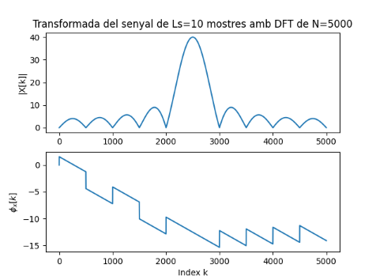

Primera tasca APA 2023: Anàlisi fitxer de so
============================================

## Nom i cognoms: Eduard Gibert Ramon


## Representació temporal i freqüencial de senyals d'àudio.

### Domini temporal

Per llegir, escriure i representar un fitxer en format `*.wav` en python podem fem servir els següents mòduls:

- Numpy:
```python
import numpy as np
```
- Matplotlib: 
```python
import matplotlib.pyplot as plt
```
- Soundfile:
```python
import soundfile as sf
```

Per **crear** i **guardar** a un fitxer un senyal sinusoidal de freqüència `fx Hz`, digitalitzat a `fm Hz`, de durada `T` segons i amplitud 
`A` fem:

```python
T= 2.5                               # Durada de T segons
fm=8000                              # Freqüència de mostratge en Hz
fx=440                               # Freqüència de la sinusoide
A=4                                  # Amplitud de la sinusoide
pi=np.pi                             # Valor del número pi
L = int(fm * T)                      # Nombre de mostres del senyal digital
Tm=1/fm                              # Període de mostratge
t=Tm*np.arange(L)                    # Vector amb els valors de la variable temporal, de 0 a T
x = A * np.cos(2 * pi * fx * t)      # Senyal sinusoidal
sf.write('so_exemple1.wav', x, fm)   # Escriptura del senyal a un fitxer en format wav
```

El resultat és un fitxer guardat al directori de treball i que es pot reproduir amb qualsevol reproductor d'àudio

Per **representar** gràficament 5 períodes de senyal fem:

```python
Tx=1/fx                                   # Període del senyal
Ls=int(fm*5*Tx)                           # Nombre de mostres corresponents a 5 períodes de la sinusoide

plt.figure(0)                             # Nova figura
plt.plot(t[0:Ls], x[0:Ls])                # Representació del senyal en funció del temps
plt.xlabel('t en segons')                 # Etiqueta eix temporal
plt.title('5 periodes de la sinusoide')   # Títol del gràfic
plt.show()                                # Visualització de l'objecte gràfic. 
```

El resultat del gràfic és:


> Nota: Si es treballa amb ipython, es pot escriure %matplotlib i no cal posar el plt.show() per veure gràfics

El senyal es pot **escoltar (reproduir)** directament des de python important un entorn de treball amb els dispositius de so, com per 
exemple `sounddevice`:

```python
import sounddevice as sd      # Importem el mòdul sounddevice per accedir a la tarja de so
sd.play(x, fm)                # Reproducció d'àudio
```

### Domini transformat

Domini transformat. Els senyals es poden analitzar en freqüència fent servir la Transformada Discreta de Fourier. 

La funció que incorpora el paquet `numpy` al submòdul `fft` és `fft`:

```python
from numpy.fft import fft     # Importem la funció fft
N=5000                        # Dimensió de la transformada discreta
X=fft(x[0 : Ls], N)           # Càlcul de la transformada de 5 períodes de la sinusoide
```

I podem representar el mòdul i la fase, en funció de la posició de cada valor amb:

```python
k=np.arange(N)                        # Vector amb els valors 0≤  k<N

plt.figure(1)                         # Nova figura
plt.subplot(211)                      # Espai per representar el mòdul
plt.plot(k,abs(X))                    # Representació del mòdul de la transformada
plt.title(f'Transformada del senyal de Ls={Ls} mostres amb DFT de N={N}')   # Etiqueta del títol
plt.ylabel('|X[k]|')                  # Etiqueta de mòdul
plt.subplot(212)                      # Espai per representar la fase
plt.plot(k,np.unwrap(np.angle(X)))    # Representació de la fase de la transformad, desenroscada
plt.xlabel('Index k')                 # Etiqueta de l'eix d'abscisses 
plt.ylabel('$\phi_x[k]$')             # Etiqueta de la fase en Latex
plt.show()                            # Per mostrar els grafics
```


Proves i exercicis a fer i entregar
-----------------------------------

1. Reprodueix l'exemple fent servir diferents freqüències per la sinusoide. Al menys considera $f_x = 4$ kHz, a banda d'una
    freqüència pròpia en el marge audible. Comenta els resultats.
 
    Fem la prova amb 4kHz i amb 2kHz de manera que:

```python
T= 2.5                               # Durada de T segons
fm=8000                              # Freqüència de mostratge en Hz
fx=4000                              # Freqüència de la sinusoide
A=4                                  # Amplitud de la sinusoide
pi=np.pi                             # Valor del número pi
L = int(fm * T)                      # Nombre de mostres del senyal digital
Tm=1/fm                              # Període de mostratge
t=Tm*np.arange(L)                    # Vector amb els valors de la variable temporal, de 0 a T
x = A * np.cos(2 * pi * fx * t)      # Senyal sinusoidal
sf.write('so_exemple1.wav', x, fm)   # Escriptura del senyal a un fitxer en format wav

Tx=1/fx                                   # Període del senyal
Ls=int(fm*5*Tx)                           # Nombre de mostres corresponents a 5 períodes de la sinusoide

plt.figure(0)                             # Nova figura
plt.plot(t[0:Ls], x[0:Ls])                # Representació del senyal en funció del temps
plt.xlabel('t en segons')                 # Etiqueta eix temporal
plt.title('5 periodes de la sinusoide')   # Títol del gràfic
plt.show()                            # Per mostrar els grafics
```


Afegim la transformada:

```python
import sounddevice as sd      # Importem el mòdul sounddevice per accedir a la tarja de so
sd.play(x, fm)                # Reproducció d'àudio

from numpy.fft import fft     # Importem la funció fft
N=5000                        # Dimensió de la transformada discreta
X=fft(x[0 : Ls], N)           # Càlcul de la transformada de 5 períodes de la sinusoide

k=np.arange(N)                        # Vector amb els valors 0≤  k<N

plt.figure(1)                         # Nova figura
plt.subplot(211)                      # Espai per representar el mòdul
plt.plot(k,abs(X))                    # Representació del mòdul de la transformada
plt.title(f'Transformada del senyal de Ls={Ls} mostres amb DFT de N={N}')   # Etiqueta del títol
plt.ylabel('|X[k]|')                  # Etiqueta de mòdul
plt.subplot(212)                      # Espai per representar la fase
plt.plot(k,np.unwrap(np.angle(X)))    # Representació de la fase de la transformad, desenroscada
plt.xlabel('Index k')                 # Etiqueta de l'eix d'abscisses 
plt.ylabel('$\phi_x[k]$')             # Etiqueta de la fase en Latex
plt.show() 
```


    - **Comentari:** Al cambiar la fx a 4kHz veiem com la señal es torna en triangular de manera que representa unes pujades i bajades constants, podem deduir que en cas de escoltar-ho si li posem una frequencia baixa sonara mes greu  i si li posem una frequencia alta sonara mes agut.

    Si mirem la fft veiem com el modul te una pujada en aproximadament 2500 i la fase baixa desde 0 fins arribar aproximadament a -15db.

2. Modifica el programa per considerar com a senyal a analitzar el senyal del fitxer wav que has creat 
    (`x_r, fm = sf.read('nom_fitxer.wav')`).

    - Insereix a continuació una gràfica que mostri 5 períodes del senyal i la seva transformada.

```python
# Importem totes les llibreries necessaries per poder llegir el fitxer i treballar amb ell
import numpy as np
import matplotlib.pyplot as plt
import soundfile as sf
import sounddevice as sd
from numpy.fft import fft  

x_r, fm = sf.read('so_exemple1.wav')       # Llegim el fitxer

T = (1/fm)*len(x_r)
Tm=1/fm 

L = int(fm * T) 
t=Tm*np.arange(L)

fx=4000
Tx=1/fx                                   # Període del senyal
Ls=int(fm*5*Tx)                           # Nombre de mostres corresponents a 5 períodes de la sinusoide
plt.figure(0)                             # Nova figura
plt.plot(t[0:Ls], x_r[0:Ls])                # Representació del senyal en funció del temps
plt.xlabel('t en segons')                 # Etiqueta eix temporal
plt.title('5 periodes de la sinusoide')   # Títol del gràfic
plt.show()                                # Visualització de l'objecte gràfic.
sd.play(x_r, fm) 
```


Afegim la transformada:

```python
sd.play(x_r, fm)    

N=5000                       
X=fft(x_r[0 : Ls], N)         
k=np.arange(N)                        
plt.figure(1)                        
plt.subplot(211)                     
plt.plot(k,abs(X))                   
plt.title(f'Transformada del senyal de Ls={Ls} mostres amb DFT de N={N}')   
plt.ylabel('|X[k]|')                 
plt.subplot(212)                      
plt.plot(k,np.unwrap(np.angle(X)))   
plt.xlabel('Index k')               
plt.ylabel('$\phi_x[k]$')             
plt.show()    
```


    - Explica el resultat del apartat anterior. 

    **Comentari:** Veiem com al tenir una frequencia de 4kHz la transformada te menys mostres que cuan la frequencia 
    es de 440, de manera que deduim que a frequencies baixes hi han mes mostres i en frequencies altes
    n'hi han menys. 
    
    Veiem que com que les grafiques son iguals en ambdos apartats les conclusions que treuem son les mateixes, pel que fa a la reprensentacio de 
    5 periodes veiem com el to que obtenim es mes agut. I per el que fa a la fft veiem que el pic es en 2500 i la fase baixa de 0 fins a a -15db.
 

3. Modifica el programa per representar el mòdul de la Transformada de Fourier en dB i l'eix d'abscisses en el marge de
    $0$ a $f_m/2$ en Hz.

```python

T= 2.5                               # Durada de T segons
fm=8000                              # Freqüència de mostratge en Hz
fx=440                               # Freqüència de la sinusoide
A=4                                  # Amplitud de la sinusoide
pi=np.pi                             # Valor del número pi
L = int(fm * T)                      # Nombre de mostres del senyal digital
Tm=1/fm                              # Període de mostratge
t=Tm*np.arange(L)                    # Vector amb els valors de la variable temporal, de 0 a T
x = A * np.cos(2 * pi * fx * t)      # Senyal sinusoidal
sf.write('so_exemple3.wav', x, fm)   # Escriptura del senyal a un fitxer en format wav
Tx=1/fx                                   
Ls=int(fm*Tx*5)                           

plt.figure(0)                             
plt.plot(t[0:Ls], x[0:Ls])               
plt.xlabel('t en segons')                 
plt.title('5 períodes')  
plt.show()   
sd.play(x,fm)         


N=5000 
X=fft(x[0:L],N) 
k=np.arange(N)  
X2 = 20*np.log10(np.abs(X)/max(np.abs(X)))
fk = k[0:N//2+1]*fm/N         #Calcul de la fk, pels valors de l'eix d'abscisses
plt.figure(1)
plt.subplot(211)   
plt.plot(fk,X2[0:N//2+1])  # Representació del mòdul de la transformada en dB y de 0 a FK/2
plt.title(f'Transformada del senyal de Ls={L} mostres amb DFT de N={N}')   
plt.ylabel('Mòdul en dB')                  
plt.subplot(212)                      
plt.plot(fk,np.unwrap(np.angle(X[0:N//2+1])) )   
plt.xlabel('f en Hz')                
plt.ylabel('$\phi_x[k]$')              
plt.show() 

```


    - Comprova que la mesura de freqüència es correspon amb la freqüència de la sinusoide que has fet servir.

    **Comentari:** SI fem servir la formula que se'ns dona a continuacio veiem com si que correspon.

    - Com pots identificar l'amplitud de la sinusoide a partir de la representació de la transformada?
      Comprova-ho amb el senyal generat.

      **Comentari:** No es pot calcular ja que si normalitzem per el máxim tenim com a resultat 1.


> NOTES:
>
> - Per representar en dB has de fer servir la fórmula següent:
>
> $X_{dB}(f) = 20\log_{10}\left(\frac{\left|X(f)\right|}{\max(\left|X(f)\right|}\right)$
>
> - La relació entre els valors de l'índex k i la freqüència en Hz és:
>
> $f_k = \frac{k}{N} f_m$

4. Tria un fitxer d'àudio en format wav i mono (el pots aconseguir si en tens amb altres formats amb el programa Audacity). 
    Llegeix el fitxer d'àudio i comprova:

    - Freqüència de mostratge.
    - Nombre de mostres de senyal.
    - Tria un segment de senyal de 25ms i insereix una gráfica amb la seva evolució temporal.
    - Representa la seva transformada en dB en funció de la freqüència, en el marge $0\le f\le f_m/2$.
    - Quines son les freqüències més importants del segment triat?

**Resolucio:** 
Farem servir el propi fitxer d'audio que se'ns proporciona : 'luzbel44.wav'

```python
T= 0.025   #donem un periode de 25ms com ens diu l'enunciat                              
data, fm =sf.read('luzbel44.wav')     #fm es la frenquencia de mostreig  
L = int(fm * T)     #el numero de mostres que te el fitxer d'audio                 
Tm=1/fm                            
t=Tm*np.arange(L)                   

plt.figure(41)                          
plt.plot(t[0:L],data[0:L])              
plt.xlabel('t en segons')               
plt.title('Exercici 4')  
plt.show()                             
```


**Transformada en db :** 

```python
N=5000                        
X=fft(data[0 : L], N)    
k=np.arange(N)                                         
plt.figure(42)                         
X3 = 20*np.log10(np.abs(X)/max(np.abs(X)))
fk = k[0:N//2+1]*fm/N
plt.subplot(211)   
plt.plot(fk,X3[0:N//2+1])  # Representació del mòdul de la transformada en dB y de 0 a FK/2
plt.title(f'Transformada del senyal de Ls={L} mostres amb DFT de N={N}')   
plt.ylabel('Mòdul en dB')                   
plt.subplot(212)                      
plt.plot(fk,np.unwrap(np.angle(X[0:N//2+1])) )   
plt.xlabel('f en Hz')                
plt.ylabel('$\phi_x[k]$')          
plt.show() 

```


Veiem gracies a 'plt.title(f'Transformada del senyal de Ls={L} mostres amb DFT de N={N}')' que el numero de mostres es de 1102.

**Frequencies mes importants:** 
Com veiem en la grafica superior, clarament les frequencies mes importants son aquelles on la grafica esta mes activa, de manera
que podriem dir que les mes importants seran aquelles situades entre 0kHz i 7000/8000kHz aproximadament.


Entrega
-------

- L'alumne ha de respondre a totes les qüestions formulades en aquest mateix fitxer, README.md.
    - El format del fitxer es l'anomenat *Markdown* que permet generar textos amb capacitats gràfiques (com ara *cursiva*, **negreta**,
      fòrmules matemàtiques, taules, etc.), sense perdre la llegibilitat en mode text.
    - Disposa d'una petita introducció a llenguatge de Markdown al fitxer `MARKDOWN.md`.
- El repositori GitHub ha d'incloure un fitxer amb tot el codi necesari per respondre les qüestions i dibuixar les gràfiques.
- El nom del fitxer o fitxers amb el codi ha de començar amb les inicials de l'alumne (per exemple, `fvp_codi.py`).
- Recordéu ficar el el vostre nom complet a l'inici del fitxer o fitxers amb el codi i d'emplar el camp `Nom i cognoms` a dalt de tot
  d'aquest fitxer, README.md.
